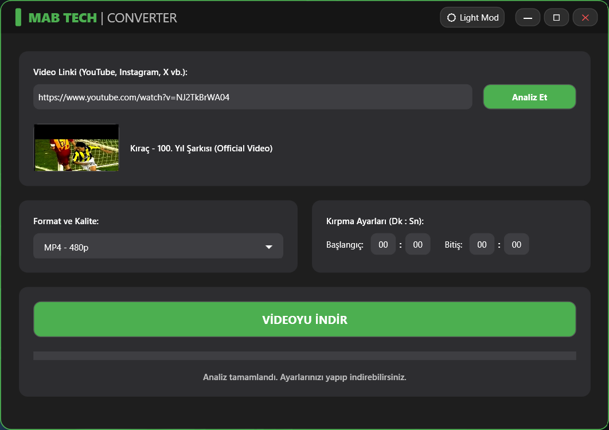

# 🚀 MAB Converter | Ultimate Media Downloader & Converter

  

🌍 **[English Version Below](#english-version)** 🇬🇧

---

### 🇹🇷 Türkçe (Turkish)

**MAB Converter**, YouTube, LinkedIn, Instagram, X (Twitter) ve daha birçok platformdan yüksek kaliteli (4K/1080p) video ve ses indirmeyi, kırpmayı ve dönüştürmeyi sağlayan profesyonel bir Windows masaüstü uygulamasıdır. 

MAB Tech tarafından geliştirilen bu araç, sıfır kalite kaybı (Remux/Stream Copy) felsefesiyle ve modern "Glassmorphism" (Cam Efekti) UI tasarımıyla öne çıkar.

## ✨ Öne Çıkan Özellikler

- **🔥 Kayıpsız İndirme (Zero Quality Loss):** YouTube'un WebM formatlarını işlerken kaliteyi bozmadan orijinal 4K/1080p MP4 olarak remux eder.
- **🎬 Akıllı Kırpma:** İndirme esnasında belirlediğiniz Dakika:Saniye aralığını CRF-18 yüksek kalitede keser.
- **🧠 Akıllı Codec Motoru:** LinkedIn veya Instagram gibi platformların desteklenmeyen formatlarını anında standart H.264 MP4'e çevirerek "Siyah Ekran" sorununu kökten çözer.
- **🎨 Modern Glass UI:** Işık/Karanlık (Light/Dark) tema desteği ve akıcı animasyonlara sahip yuvarlatılmış cam tasarımı.
- **⚡ Otomatik Bağımlılık Yönetimi:** Arka planda çalışan `yt-dlp` ve `ffmpeg` motorlarını ilk açılışta otomatik olarak günceller ve yapılandırır.

## 📥 Kurulum & İndirme

Projeyi kaynak kodundan derlemekle uğraşmak istemiyorsanız, doğrudan kurulabilir `.exe` versiyonunu indirebilirsiniz.

1. <a href="https://mabtech.me/Home/ProjectDetail/8" target="_blank">mabtech.me</a> adresine gidin.
2. `MAB_Converter_Setup_v1.0.exe` dosyasını indirin.
3. Kurulumu çalıştırın (Tüm bağımlılıklar ve motorlar otomatik olarak kurulacaktır).
4. Masaüstündeki MAB Converter ikonuna tıklayarak keyfini çıkarın!

## 💻 Geliştiriciler İçin (Kaynak Kodu)

Projeyi kendi bilgisayarınızda geliştirmek istiyorsanız:

1. Bu depoyu klonlayın: `git clone https://github.com/Mertcan-BZTPRK/MAB_Converter.git`
2. Visual Studio 2022 ile `MAB_Converter.sln` dosyasını açın.
3. Gerekli NuGet paketlerini (YoutubeDLSharp vb.) geri yükleyin (Restore).
4. Projeyi derleyip çalıştırın.

## 🛠️ Kullanılan Teknolojiler
* **C# / WPF:** Arayüz ve temel programlama mantığı.
* **YoutubeDLSharp:** Medya analiz ve indirme köprüsü.
* **yt-dlp & FFmpeg:** Arka plan medya motorları (Gelişmiş komut setleriyle optimize edilmiştir).
* **Inno Setup:** Kurulum (Setup) paketlemesi.

## 📝 Lisans
Bu proje **MIT Lisansı** ile lisanslanmıştır. Daha fazla bilgi için `LICENSE` dosyasına göz atabilirsiniz.

---
*Geliştirici:* **[Mertcan Boztoprak (MAB Tech)](https://www.linkedin.com/in/mertcan-boztoprak)**

 
 

---

### 🇬🇧 English

**MAB Converter** is a professional Windows desktop application that allows you to download, crop, and convert high-quality (4K/1080p) video and audio from platforms like YouTube, LinkedIn, Instagram, X (Twitter), and more. 

Developed by MAB Tech, this tool stands out with its zero quality loss (Remux/Stream Copy) philosophy and modern "Glassmorphism" UI design.

## ✨ Key Features

- **🔥 Lossless Download (Zero Quality Loss):** Remuxes YouTube's WebM formats into original 4K/1080p MP4 without compromising quality.
- **🎬 Smart Cropping:** Cuts the specified Minute:Second range in high-quality CRF-18 directly during the download process.
- **🧠 Smart Codec Engine:** Instantly converts unsupported formats from platforms like LinkedIn or Instagram to standard H.264 MP4, permanently solving the "Black Screen" issue on Windows.
- **🎨 Modern Glass UI:** Rounded glass design with Light/Dark theme support and fluid animations.
- **⚡ Automatic Dependency Management:** Automatically updates and configures the background `yt-dlp` and `ffmpeg` engines on the first launch.

## 📥 Installation & Download

If you don't want to deal with compiling from source code, you can directly download the installable `.exe` version.

1. **[Go to the site] <a href="https://mabtech.me/Home/ProjectDetail/8" target="_blank">mabtech.me</a>
2. Download the `MAB_Converter_Setup_v1.0.exe` file.
3. Run the setup (All dependencies and engines will be installed automatically).
4. Click the MAB Converter icon on your desktop and enjoy!

## 💻 For Developers (Source Code)

If you want to build and develop the project on your own machine:

1. Clone this repository: `git clone https://github.com/Mertcan-BZTPRK/MAB_Converter.git`
2. Open the `MAB_Converter.sln` file with Visual Studio 2022.
3. Restore the required NuGet packages (YoutubeDLSharp, etc.).
4. Build and run the project.

## 🛠️ Technologies Used
* **C# / WPF:** UI and core programming logic.
* **YoutubeDLSharp:** Media analysis and download bridge.
* **yt-dlp & FFmpeg:** Background media engines (optimized with advanced command sets).
* **Inno Setup:** Setup packaging.

## 📝 License
This project is licensed under the **MIT License**. For more information, check out the `LICENSE` file.

---
*Developer:* **[Mertcan Boztoprak (MAB Tech)](https://www.linkedin.com/in/mertcan-boztoprak)**

